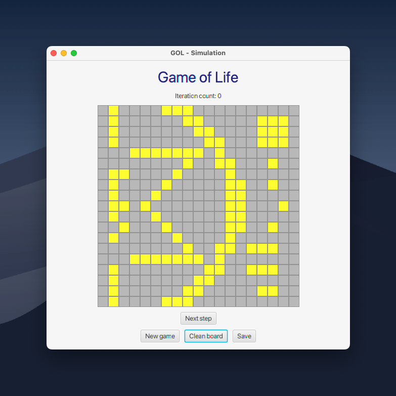

# game-of-life

Java implementation of Conway's Game of Life with JavaFX GUI, developed for the Component Programming (Programowanie komponentowe) course.



## Requirements

- Java 23+
- Maven 3.6+

## Project Structure

game-of-life/
├── Model/                          # Game logic module
│   ├── src/main/java/org/example/
│   │   ├── GameOfLifeBoard.java              # Board data model
│   │   ├── GameOfLifeCell.java               # Single cell (state, neighbours, rules)
│   │   ├── GameOfLifeLine.java               # Abstract base for row/column
│   │   ├── GameOfLifeRow.java                # Row of cells
│   │   ├── GameOfLifeColumn.java             # Column of cells
│   │   ├── GameOfLifeSimulator.java          # Simulator interface
│   │   ├── PlainGameOfLifeSimulator.java     # Default simulator implementation
│   │   ├── Dao.java                          # Generic DAO interface
│   │   ├── FileGameOfLifeBoardDao.java       # File-based DAO implementation
│   │   └── GameOfLifeBoardDaoFactory.java    # DAO factory
│   └── src/test/java/org/example/           # Unit tests
├── View/                           # JavaFX GUI module
│   ├── src/main/java/org/example/view/
│   │   ├── HelloApplication.java            # JavaFX entry point
│   │   ├── ConfigurationController.java     # Configuration screen controller
│   │   ├── SimulationController.java        # Simulation screen controller
│   │   ├── LevelSize.java                   # Enum: board size presets
│   │   └── LevelDensity.java               # Enum: cell density presets
│   └── src/main/resources/org/example/view/
│       ├── configurationScene.fxml          # Configuration screen layout
│       └── simulationScene.fxml             # Simulation screen layout
└── pom.xml                         # Root multi-module Maven build

## Running

```bash
# JavaFX GUI
mvn javafx:run -pl View

# Console (Model only)
mvn compile exec:java -pl Model
```

## Testing & Verification

```bash
# Run tests
mvn test

# Full verification (tests + checkstyle + coverage)
mvn verify

# Generate HTML reports (coverage, checkstyle) — output: Model/target/site/
mvn site -pl Model
```